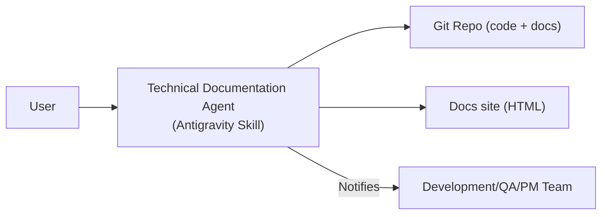

# Technical Documentation Agent

## Executive Summary  
The **Technical Documentation Agent** is a specialized Antigravity skill designed to orchestrate and generate high-quality technical documentation for our Company OS. Its purpose is to ensure all technical content – including architecture diagrams, API references, tutorials, runbooks, release notes, FAQs, and more – is complete, consistent, and up-to-date. The agent’s responsibilities span gathering requirements from engineers, PMs and support teams; authoring and updating docs in the appropriate formats; enforcing style and accessibility standards; integrating with CI/CD pipelines for automated testing and publishing; and coordinating reviews and handoffs.  

This document provides a comprehensive deep-dive into the agent’s scope, including: templates for common document types (e.g. architecture docs, API specs, runbooks), writing standards and style guides (Microsoft, Google, WriteTheDocs, Plain English, WCAG accessibility), supported formats and tools (Markdown, MkDocs, Sphinx, Docusaurus, OpenAPI/Swagger, AsyncAPI, PlantUML, Mermaid, etc.), documentation workflows (versioning, pull-request reviews, automated builds, localization), metadata and machine-readable contracts (YAML front-matter, OpenAPI schemas), memory and artifact management, QA and metrics (readability scores, coverage, link checking, docs-as-tests), security/privacy considerations, and integrations with other Antigravity agents and stakeholders.  We include examples, templates, mermaid diagrams, charts, a comparison table of doc formats/tools, and a sample Antigravity workflow (`/technical-documentation`) to illustrate how this agent operates end-to-end.

---

## Agent Purpose and Scope  
**Purpose:** The agent’s goal is to create and maintain comprehensive technical documentation for our systems and products, treating documentation with the same rigor as code. It centralizes knowledge and ensures it is accessible to engineers, PMs, QA, and support staff.  

**Scope and Responsibilities:** The Technical Documentation Agent will:  
- **Collect requirements:** Interview stakeholders (developers, product managers, support) to gather feature details, design info, and common user questions.  
- **Draft documents:** Generate or update documents using templates (architecture overviews, API references, SDK guides, tutorials, runbooks, troubleshooting guides, FAQs, release notes, changelogs, onboarding guides, etc.).  
- **Enforce style and quality:** Apply editorial guidelines (see *Writing Standards*) to ensure clarity, consistency, and accessibility. Use active voice, plain language, short sentences, and diagrams with alt text.  
- **Integrate automated tooling:** Work with the CI/CD pipeline to run spell-checkers, link-checkers, linters (for syntax and style), example validators, and docs-as-tests tools. Verify code snippets and commands actually work (see *QA & Metrics*).  
- **Collaborate on reviews:** Orchestrate peer reviews by technical writers, SMEs, QA, and legal as needed. Manage pull requests for doc updates, assign reviewers (Dev for accuracy, UX for clarity, legal for compliance).  
- **Publish and version:** Build and deploy the documentation site (e.g. static site generator) as part of releases, and manage versioned docs per product release cycle. Handle localization workflows for translated docs.  
- **Maintain metadata/contracts:** Utilize machine-readable standards like OpenAPI/AsyncAPI for API references, include structured front-matter (YAML/TOML) in markdown pages, and JSON schema for config or data models.  
- **Knowledge management:** Store document templates, style rules, and previous versions in memory for reuse. Provide retrieval (e.g. search by tags or semantic queries) to find relevant past content or templates.  
- **Security/Compliance:** Scan documentation content for sensitive information (PII, credentials) and enforce compliance rules. Ensure any example data respects privacy guidelines (e.g. synthetic data in examples).  
- **Integration with workflows:** Trigger on user command (e.g. `/technical-documentation <project>`), then sequentially execute sub-tasks (see *Workflow Example* below). Coordinate with other agents (Dev, QA, Support) to gather input and hand off artifacts when done.

**Inputs:** Project codebase, design documents, API schemas, issue tickets, user feedback, existing docs, style guides, templates.  
**Outputs:** Markdown (and other format) documents – e.g. `architecture.md`, `api-reference.md`, `runbook.md`, `release-notes.md`, etc. – plus any generated diagrams (PlantUML/Mermaid PNGs or SVGs), and updated metadata (version front-matter).  

The agent treats documentation as a “Docs-as-Code” practice, leveraging version control, CI/CD builds, and automated tests for docs. It ensures that documentation is kept in sync with code and product changes.

---

## Templates and Content Types  
The agent provides templates and guides for all common documentation deliverables. Examples include:

- **Architecture Documents:** System design overviews, data flow diagrams, component architecture. Include objectives, high-level diagrams, component descriptions, and decisions. (Tools: PlantUML/Mermaid for diagrams, Markdown or reStructuredText).  
- **API Documentation:** Use OpenAPI/Swagger or AsyncAPI specs as source. Generate reference docs listing endpoints, parameters, schemas, and example requests/responses. Include authentication, error codes, and usage examples. (Tools: Swagger UI, Redoc, Docusaurus Swagger plugin).  
- **SDK Guides / Client Libraries:** Quick-start guides showing how to install and call the SDKs in various languages. Code examples with install commands and sample calls.  
- **Runbooks/Operations Guides:** Step-by-step instructions for common ops tasks (deploying, troubleshooting incidents). Sections for prerequisites, steps, expected results, rollback actions. (Often in Markdown with a clear steps format).  
- **Onboarding Guides:** “Getting Started” documents for new users or new hires. Cover setup steps, environment prep, and example projects.  
- **Release Notes / Changelogs:** Chronological lists of fixes, features and breaking changes per release. Include links to issues or PRs, and versions. Use semantic headings by release number.  
- **Tutorials and How-Tos:** Task-oriented guides for end users (e.g., “How to set up X”, “Using feature Y”). Include narrative, code samples, screenshots/diagrams.   
- **Troubleshooting FAQs:** Q&A format or symptom/solution tables. Extract from support tickets common questions.  
- **Frequently Asked Questions:** General Q&A about product features, definitions, and best practices. (Often curated at end of guides or standalone).

Each template has **front-matter metadata** (YAML or TOML) at top of file, specifying title, version, date, tags, and other context. For example:

```yaml
---
title: "API Reference"
description: "Complete reference for all REST API endpoints."
version: "v1.2"
tags: ["api","reference"]
sidebar: "Documentation"
---
```

The agent auto-populates much of this metadata and fills skeleton sections. It uses consistent structures (e.g. table of contents, standardized code block styles).

---

## Writing Standards & Style Guides  
To maximize clarity and usability, the agent enforces established style guidelines:  

- **Clarity and plain language:** Write clear, concise sentences. Use the active voice, and everyday terms. Avoid unnecessary jargon and overly long words. For example, prefer *“download”* over *“experience the latest innovations”*. Aim for short sentences (15–25 words) and one idea per sentence. Important information should appear early. Vary sentence lengths to improve readability.  
- **Consistent tone:** Follow guidelines like the Google Developer Style and Microsoft Writing Style for a professional, friendly tone. For instance, Google advises writing *“clear and consistent technical documentation”* targeted to developers. Microsoft recommends a warm, conversational tone (using “we”/“you” where appropriate) and a serial Oxford comma.  
- **Structured organization:** Use headings and lists to break content into scannable sections. A clear structure reduces cognitive load and helps users find answers quickly. Apply the DIÁTAXIS framework (tutorials, how-to, reference, explanation) so that each document has a clear purpose.  
- **Voice & Grammar:** Use active voice and present tense. Define acronyms on first use. Stick to **sentence-style capitalization** (capitalize only the first word and proper nouns in headings) unless project style dictates otherwise. Follow the Chicago Manual and Merriam-Webster for general language questions, deferring to Google/Microsoft guides on technical terms.  Break any “rules” if it improves clarity.  
- **Accessibility:** Ensure content is inclusive and accessible. Follow Web Content Accessibility Guidelines (WCAG): use semantic HTML (proper headings, alt text for images), high-contrast colors in diagrams, and avoid idioms (especially those that reference violence). Write in plain English (sometimes called plain language) so non-native speakers can understand. Avoid complex sentences and jargon; if necessary, explain terms at first use. Use lists and tables appropriately for screen-reader friendliness.  
- **Inclusive language:** Avoid biased or insensitive language (gender, cultural, disability). E.g. use “developers” instead of “guys”, “they” instead of generic “he/she” unless context is gendered. The WriteTheDocs and gov.uk style guides have good advice on this.  
- **Style guides:** Where available, adopt existing guides. For example:  
  - **Microsoft Writing Style Guide:** Emphasizes brevity, user-focused terms, and active voice.  
  - **Google Developer Documentation Style:** Focuses on clarity and consistency for technical audiences. (It suggests breaking rules rather than writing something barbaric.)  
  - **WriteTheDocs Style:** Advocates a consistent voice to reduce reader effort and increase trust.  
  - **Plain English/PLAIN:** Emphasizes that plain language “allows the audience to easily understand and act upon information the first time they read it”.  
  - **Accessibility and Anti-bias Guides:** Ensure compliance with WCAG; avoid idioms like “kill two birds with one stone”.  
- **Format consistency:** Use Markdown (or chosen formats) consistently (e.g. for headings, code blocks, admonitions). Keep styling (e.g. backticks for code, bold for UI elements) uniform. Tools like linters (Vale, markdownlint) can enforce style rules automatically.

_Example:_ “Click **Continue** to proceed.” (Active, imperative voice, clear UI label emphasis, no jargon.)  

Citations: Clear, consistent documentation improves comprehension and confidence; plain language writing makes content concise and easier to scan. 

---

## Documentation Formats and Tools  

| **Tool / Format** | **Description** | **Pros** | **Cons** | **Recommended Use** |
|------------------|----------------|----------|----------|--------------------|
| **Markdown**      | Lightweight markup for plain text. Universal support, easy syntax. | Simple, readable raw text; widely supported in Git and static site generators. | Limited built-in features (no complex tables natively, limited directives); needs plugins for advanced features. | General docs, tutorials, README, where simplicity and portability are key. |
| **AsciiDoc**      | More powerful than Markdown (supports variables, conditionals, includes) and rich styling. | Advanced features (outlines, tables, callouts); good for large docs; AsciiDoc flavor supported by Antora. | Less familiar to some writers; requires specific toolchain (Asciidoctor) | Complex documentation projects (e.g. software reference manuals) requiring modularization and advanced formatting. |
| **reStructuredText (reST)** | Original Sphinx format. Very flexible (directives, crossrefs, math). | Excellent for complex docs (Sphinx), cross-linking, extensional (extensions available). | Steeper syntax; less popular now; tooling mostly Python-centric. | Python projects (Sphinx), projects needing PDF output or heavy customization. |
| **MkDocs**        | Static site generator using Markdown (usually with Material theme). | Simple configuration; built-in search, navigation; fast builds. | Less flexible than Sphinx; limited to Markdown content. | Lightweight projects needing quick docs site (open-source projects, internal wikis). |
| **Sphinx**        | Python-based static site generator (reST / Markdown via MyST). | Powerful, multi-format (HTML, PDF) output; many extensions (code docs, math). | Setup/config can be complex; majority Python-oriented. | Extensive docs (libraries, APIs) especially in Python; multi-language output. |
| **Docusaurus**    | React-based SSG with MDX (Markdown + JSX). | Modern look; supports blogs, versioning, search; integrates with React. | Requires Node.js environment; can be overkill for simple docs. | Products/SDKs with a web portal; when you need a polished web UI and blog/news alongside docs. |
| **Swagger / OpenAPI** | Standard for describing REST APIs (YAML/JSON). | Enables auto-generation of API reference (Swagger UI, Redoc). Supports client codegen. Machine-readable spec. | Learning curve for spec syntax; only for HTTP APIs. | Any REST API documentation; integration with development (client libraries, testing). |
| **AsyncAPI**      | Specification for event-driven (message) APIs. | Similar to OpenAPI but for pub/sub systems. | Niche (only event-driven), fewer tooling. | Systems using Kafka, MQTT, etc., needing catalog of message contracts. |
| **PlantUML**      | Text-based UML tool (diagrams from code). | Rich diagram types (class, sequence, component, etc.); can output PNG/SVG; integrates in many editors. | Requires Java; syntax more verbose; styling limited. | Detailed technical diagrams (architecture, UML class). Good when exact UML is needed. |
| **Mermaid**       | Text-based diagrams (flowcharts, sequence, gantt, etc.) embedded in Markdown. | Easy syntax, integrates natively in many Markdown renderers (GitHub, GitLab, docs frameworks). No external engine needed. | Less control over styling; not as feature-rich (no native UML class support). | Quick workflow/process diagrams, simple architecture sketches. Ideal for docs-as-code (no extra tool). |
| **API Blueprint** | Markdown-like API spec format. | Human-readable, simple. | Less popular; fewer tools than OpenAPI. | Small-scale API docs where tooling is not a priority. |
| **JSON / YAML Schema** | Schema definitions for data models. | Machine-readable, used to generate code and validate examples. | Not human-friendly alone. | Documenting JSON payloads, configurations, or validating sample data. |

**Source:** Many documentation frameworks (e.g. GitHub Pages, MkDocs, Docusaurus, ReadTheDocs) support these formats. For example, MkDocs “is a powerful documentation tool for Markdown” and Sphinx has many features for technical docs. The OpenAPI Specification “defines a standard, language-agnostic interface to HTTP APIs”, enabling automated reference docs. The AsyncAPI Specification similarly describes message-driven APIs in machine-readable form. Mermaid integrates seamlessly with Markdown and static site generators, whereas PlantUML excels when you need full UML diagrams.

---

## Documentation Workflows  

The agent operates within a **Docs-as-Code** workflow, treating docs like software: everything is in version control, changes are reviewed via PRs, and builds/tests are automated. A typical workflow is:

1. **Authoring:** Writers/editors create or update `.md` files in the docs repo (or alongside code). The agent may kick off this work when new features land or via an explicit command. Templates (with front-matter) ensure consistent structure.  
2. **Version Control:** Every doc change is a commit in Git (branch per feature or version). Metadata in front-matter (e.g. `version: 1.3`) aligns docs with product releases.  
3. **Peer Review:** Authors open a Pull Request. Required reviewers may include SMEs (for technical accuracy), a lead writer (for style), and QA or support (for clarity).  The agent can suggest reviewers based on content. Reviewers check factual correctness, clarity, and style (see *Writing Standards*).  
4. **Automated Checks:** On PR, CI runs documentation linting (spell-check, grammar, style linters like Vale), code example validation (compiling/running snippets), link checking (for broken internal/external links), and compliance scans (for secrets or PII). The agent reports any failures so authors can fix issues early.  
5. **Merge & Publishing:** Once approved, docs are merged into the main branch. A CI/CD pipeline then builds the docs site (using MkDocs/Sphinx/Docusaurus, etc.) and deploys it to the company’s documentation host (e.g. Docs portal or internal static site). Versioning is applied (e.g. URLs include product version). Release notes and changelogs may be auto-generated from git tags and appended.  
6. **Localization:** If needed, content is extracted for translation (strings in resource files or markdown to a localization platform). Translations are then integrated back (e.g. via branches or CMS) and published alongside the original. Using **continuous localization**, the agent can trigger updates when source docs change.  

```mermaid
flowchart LR
    Codebase["Code \n& Specs"] --> DocsAgent[Technical Documentation Agent]
    DocsAgent --> Drafts[Draft Docs (Markdown)]
    Drafts --> |PR & Review| Reviewers
    Reviewers --> |Approve| CI
    CI --> |Build/Test Docs| DocsBuild[Documentation Site]
    DocsBuild --> Publish[Hosted Docs (Static Site)]
    Publish --> Stakeholders[Devs / QA / PM / Support]
```

This workflow ensures documentation keeps pace with development. As Pronovix describes, writers “use the same IDE and workflows as developers”, with version control, PRs, and CI/CD. For example, one case study shows a writer pulling the repo, pushing a change request, running validators, and merging when tests pass.  Another (Docsie) depicts a pipeline graph where Markdown → Git → PR → review → CI/CD → deployment.

**Authoring Guidelines:** The agent uses *single-sourcing* where possible (reuse content blocks), and templates for each doc type. It may store task-specific memory (e.g. PR review checklists, previous changelogs) for reuse.  

**Review & Approvals:** See *Templates* below for a **Documentation PR Checklist** (ensuring style, links, images, example code, etc., are all correct before merge).

**Versioning:** Docs mirror code versioning. For a new release, branch docs according to version (e.g. `/docs/v2.0/`). The agent can also backport critical fixes to older doc versions.  

**Publishing:** Often via tools like GitHub Pages, ReadTheDocs, or a proprietary docs portal. The CI process publishes to staging for review, then to production on merge tags. 

**Continuous Feedback:** User feedback (via comments or issue trackers) can be routed back into the pipeline as tasks for the agent (e.g. “incorrect step in tutorial”).

---

## Metadata & Machine-Readable Contracts  

The agent leverages **structured metadata** and **contracts** to enhance automation:

- **Front-Matter Metadata:** Each doc file begins with YAML/TOML front-matter specifying title, description, version, date, tags, author, etc. This metadata is used by the docs framework (for navigation, indexing, and templates) and by the agent’s routing logic. For example, Jekyll/MkDocs treat any file with YAML front-matter as a special document that can be processed and included in the site structure.  Front-matter variables like `title`, `nav_order`, or custom tags are then available in templates.  
- **API Contracts (OpenAPI/AsyncAPI):** For REST APIs, the agent uses OpenAPI 3.2 (or earlier) YAML/JSON files as the canonical source. As the spec notes, **OpenAPI** defines a standard, language-agnostic interface for HTTP APIs. The agent can auto-generate reference docs (via tools like Swagger UI or Redoc) directly from these specs, ensuring consistency with code. For message-driven (event) APIs, AsyncAPI provides the analogous machine-readable spec. These schemas become part of the memory: the agent can query them to list endpoints, parameters, or examples.  
- **Documentation Schema:** Where needed, use JSON Schema or other schemas to define structured data in docs (e.g. configuration files, data models). Embedding schema snippets ensures examples stay valid.  
- **Spec Updates:** If code changes, the agent can detect schema drift and alert if docs (OpenAPI/AsyncAPI) need updates.  
- **Other Contracts:** For embedded assets (like charts), alt-text metadata is required. Licensing or compliance metadata (e.g. target audience, regulatory notes) can also be added in front-matter or document headers.  

*Example Front-Matter Block:*  

```yaml
---
name: technical-documentation
description: "Generates and maintains comprehensive technical documentation (architecture, APIs, runbooks, tutorials) following style guidelines and automated QA."
version: "1.0"
author: "Docs Team"
triggers: ["/technical-documentation"]
---
```

This metadata (especially the `triggers` or `description` in skills) is what Antigravity uses to match user intents.

---

## Memory & Artifacts  

The agent’s “memory” consists of persistent reference materials and outputs, for reuse and context:  

- **Templates and Style Guides:** Stored templates for each doc type and the style guides (Microsoft, Google, WriteTheDocs docs) are kept in memory so the agent recalls formatting rules and examples.  
- **Document History:** Past versions of docs (in Git) act as memory. The agent can search commit history or previous releases to retrieve information. For example, to write a changelog, it can pull commit messages or past changelog entries.  
- **Frequently Asked Questions (FAQs):** A curated Q&A knowledge base can be stored so the agent can auto-suggest answers to common queries.  
- **Glossaries and Code Lists:** Domain-specific terms, configuration options, or code snippet libraries can be cached for quick insertion.  
- **User Feedback & Issues:** Tagged feedback or doc issues from trackers can be retrieved to learn where docs often fail. The agent may recall similar issues when generating troubleshooting sections.  
- **Tool Outputs:** CI check results (like link-check reports, spell-check output) can be stored as artifacts for audit and to guide improvements.  

For retrieval, the agent uses semantic search or keyword matching on this memory. For example, a prompt “Explain the release process” might trigger retrieval of the “Release Guide” template or past release notes.

---

## Quality Assurance & Metrics  

To ensure documentation quality, the agent implements objective QA checks and tracks metrics:

- **Readability:** Aim for accessible reading levels. Tools (like [Flesch–Kincaid](https://en.wikipedia.org/wiki/Flesch%E2%80%93Kincaid_readability_tests)) can score docs; strive for moderate levels for broad audiences. Check average sentence length, passive voice occurrences, jargon density.  
- **Style/Lint Coverage:** Use linters (e.g. Vale, markdownlint) to enforce style guide rules. Automate corrections where feasible (e.g. consistent capitalization, serial commas). Track *style compliance rate*.  
- **Completeness:** Ensure all required sections are filled. For API docs, check that every endpoint in the spec is documented. (Docs-as-Code tests can verify no missing docs.)  
- **Link Rot and Broken References:** Run automated link-checkers on each build. Report any dead links. The agent fixes or flags them before publishing.  
- **Example Validation (Docs-as-Tests):** Code examples and commands in docs are treated as tests. The agent can execute or compile examples in CI (e.g. run snippet code, curl calls, or Terraform plan for infrastructure code) to ensure accuracy. If a documented procedure fails, it is flagged for correction. Manny Silva’s “Docs as Tests” concept applies: *docs are assertions about the system, so they can and should be tested*.  
- **Coverage:** Define metrics for *documentation coverage*: e.g. percentage of public APIs referenced in docs, % of product features documented, etc. The agent can compare code modules vs docs files to spot gaps.  
- **User Feedback:** Track doc issue resolution time and the number of user-reported documentation bugs. A drop in support tickets after updates indicates better docs.  
- **Documentation Usability Testing:** Occasionally involve user testing (or gather analytics like time on page, searches) to measure if readers find info efficiently.  

**Docs-as-Tests:** The agent integrates or generates test cases for documentation. For example, if a tutorial says “Step 3: type `foo`”, a test script can verify that running `foo` works.  This follows the principle “docs are inherently tests”. On every docs PR, example-driven tests run to catch out-of-date instructions or code.  

**CI/CD Integration for QA:** As part of the pipeline, automated checks (spellcheck, broken-link scans, code builds from examples) run on every docs commit. Errors must be fixed before merge. The Pronovix example shows doc commits triggering validators to catch errors early.

---

## Security, Privacy & Compliance  

Because documentation may contain sensitive details, the agent enforces security and compliance:

- **Secrets and Credentials:** Never include real passwords, keys, or tokens in docs or screenshots. Use dummy values or placeholders. Employ automated **secret scanning** (e.g. GitHub’s secret scanning or tools like truffleHog) on docs content. Secrets can leak into docs or even training videos. Scanning must detect API keys, SSNs, PII, and block any such content.  
- **PII/Data Protection:** Ensure examples do not use real personal data. As noted in industry case studies, API examples often inadvertently include sensitive IDs (GDPR issue). The agent should enforce using synthetic or generic data. Incorporate **compliance scanning** tools (e.g. AWS Macie, Presidio) in the docs pipeline to flag SSNs, email addresses, or locations. Block publishing until these are replaced.  
- **Regulatory Guidelines:** For regulated industries (finance, healthcare), ensure docs meet legal requirements (e.g. HIPAA disclaimers). Include necessary warnings; have the legal team review relevant content.  
- **Access Control:** Limit who can edit or view sensitive docs. E.g. internal secure-runbooks may require authentication or encryption. The agent should mark such docs as restricted in metadata.  
- **Audit Trail:** Every published document should have a changelog of who updated it and when (front-matter or site footer). This aids compliance reviews.  
- **Content Validation:** Especially for security-critical commands (firewall rules, encryption setup), cross-check procedures against security policies.  
- **Dependency Security:** Document any third-party components; verify licenses and security posture.  
- **Training Data Concerns:** If the agent learns from code or docs, ensure training data (from codebase) does not include secrets or proprietary algorithms.  

In short, embed security checks into the doc workflow: **“Documentation also needs a compliance review”** – as [51†L114-L122] demonstrates, automated compliance scanning can block PII before docs go public. The agent can be configured to *block merge/publication* on high-risk findings.

---

## Integration with Antigravity Workflows  

This skill integrates seamlessly into our Antigravity-based development processes:

- **Triggering the Agent:** A user (developer, PM, writer) invokes the skill via a slash command, e.g. `/technical-documentation generate` or by asking the Copilot “Document feature X”. The YAML frontmatter `triggers` and `description` (see *Metadata*) guide Antigravity’s intent matching.  
- **Step-by-Step Orchestration:** The skill’s **Instructions** section (SKILL.md body) defines a multi-step plan. For example: 
  1. *Goal:* Gather inputs to draft required docs.  
  2. *Instructions:* - Identify target audience and document scope. - Collate code endpoints and design notes. - Use templates to create each doc type. - Enforce style and run checks (spell, lint, example tests). - On completion, push updates or open PR.  
  3. *Scripts Integration:* The skill can call scripts (Python, bash) for tasks like invoking `swagger-codegen`, running link-check, or building the site. (Skills can include `scripts/` to extend capabilities.)  
  4. *Constraints:* E.g. “Do not publish without legal approval,” or “Avoid deleting user-provided content.”  

- **Example Workflow Snippet:** A sample Antigravity Workflow file (`workflows/technical-documentation.yaml`) might look like:

  ```yaml
  name: technical-documentation
  description: Orchestrate creation and review of technical documentation.
  steps:
    - name: GatherContext
      prompt: >
        You are a TechDoc agent. First, list all features or components that need documentation by querying the project codebase and user stories.
    - name: OutlineDocs
      prompt: >
        Based on features, outline required doc types (arch design, API, runbook, tutorial, FAQ).
    - name: GenerateDocs
      prompt: >
        For each document type, use the appropriate template. E.g., create 'API Reference' from OpenAPI spec, 'Architecture Design' from system diagrams.
    - name: EnforceStyle
      script: scripts/run_linters.sh
      constraints:
        - All docs must meet style guidelines.
        - Avoid using passive voice.
    - name: QA
      prompt: >
        Run automated checks: spell-check, link-check, example code execution. Report any errors.
    - name: Finalize
      prompt: >
        Summarize changes, commit docs to repo, and open a pull request. Include reviewers: dev lead, QA, support.
  ```

  In practice, a developer could simply type `/technical-documentation` and the agent would execute these steps sequentially.

- **Entity Relationship Diagram:** (conceptual) Mermaid code below shows how this agent interacts with other roles:

  ```mermaid
  flowchart TD
    Devs/PMs -->|Request Docs| Agent[Technical Documentation Agent]
    Agent -->|Reads| Repo[Code/Specs Repository]
    Agent -->|Reads| Design[Architecture Diagrams]
    Agent -->|Creates| Docs[Documentation Files]
    Docs -->|Deployed to| Site[Docs Website]
    QA/Support -->|Review & Feedback| Agent
    Agent -->|Hand off Reports| PM/Dev
  ```

- **Ruflo-Style Orchestration:**  The agent can be part of larger workflows. For instance, when a new feature branch is merged, a Ruflo rule could auto-invoke `/technical-documentation` to update docs for that feature.

This integration ensures documentation is not an afterthought but a first-class part of the dev workflow, as envisioned in Antigravity’s design of on-demand Skills.

---

## Handoffs to Dev/QA/PM/Support  

The Technical Documentation Agent bridges multiple teams:

- **Developers:** Provide the agent with code comments, schema (OpenAPI/AsyncAPI), and explanations of new features. The agent translates these into user-facing docs. Developers may review draft docs for technical accuracy.
- **QA/Testers:** QA teams verify documented test cases and troubleshooting steps. They can report gaps or errors, which the agent then addresses. The agent’s docs-as-tests integration also ties into QA’s test suites.  
- **Product Managers:** PMs clarify business context, user personas, and priorities. They review release notes, tutorials, and high-level overviews for completeness. The agent requests clarifications (e.g. “Is this feature admin-only?”) from the PM.  
- **Support/Field Engineers:** They contribute common customer questions and real-world usage tips to FAQs and troubleshooting sections. After documentation updates, the agent hands off changes to support so they can use the latest info.  
- **Legal/Compliance:** These teams review any content with potential liability (safety instructions, data handling). The agent flags such content for legal review prior to publishing and integrates any required disclaimers.  

At each handoff, the agent documents the transition (e.g. “Docs ready for QA review”, “Support notified of updates”) and may automatically notify via chat/issue. This ensures a collaborative cycle: author → peer review (tech writers) → engineering review → QA review → legal review → merge and publish.

---

## Tools Comparison (Formats & Use-Cases)

| **Tool/Format** | **Pros** | **Cons** | **Best Use-Cases** |
|---------------|-------|-------|-----------------|
| **Markdown** | Very simple syntax; excellent tool support (GitHub, SSGs). Easily versioned. | Limited semantic features (no native variables or advanced styling). | General documentation, README, quick wikis, where lightweight authoring is needed. |
| **AsciiDoc** | Richer features (content reuse, conditionals, complex tables). Great for large docs. | Less mainstream; steeper learning curve; requires Asciidoctor. | Large docs with many contributors, reusable modules (e.g. booklets, manuals). |
| **reStructuredText** | Powerful directives, Sphinx extensions, built-in cross-references, math support. | More complex syntax; mainly Python ecosystem. | Python projects (Sphinx docs), academic documentation needing equations. |
| **MkDocs** | Easy setup for Markdown; fast builds; integrated search; themes like Material. | Limited to Markdown content; fewer plugins than Sphinx. | Small-to-medium projects needing a clean, searchable docs site quickly. |
| **Sphinx** | Extensive output (HTML, PDF); supports both reST and Markdown (via MyST). Many plugins (autodoc, MathJax). | Configuration can be complex; updates require rebuilding. | Comprehensive documentation (libraries, APIs, specifications) where multi-format output is needed. |
| **Docusaurus** | Modern React site; built-in versioning, i18n, search. MDX allows embedding React components. | Requires Node.js environment; heavier setup; theme constraints. | Products with web presence that need polished UI, blogs, or integration into React ecosystems. |
| **OpenAPI/Swagger** | Official API specification; generates interactive docs (Swagger UI). Supports codegen. | Only for REST APIs; spec can be verbose. | REST API documentation and client SDK generation. |
| **AsyncAPI** | Standard for async/event APIs; generates docs for Kafka, MQTT, etc. | Niche use-case; fewer UI tooling. | Documenting message-driven architectures (microservices events). |
| **PlantUML** | Textual UML; supports sequence, class, component, etc.; offline SVG/PNG export. | Java-based; not built into Markdown by default. | Detailed architecture or UML diagrams; when precision is needed. |
| **Mermaid** | Text-based, built into many Markdown engines (GitHub, GitLab, MkDocs). | Fewer diagram types (no native class diagrams). Styles limited. | Quick flowcharts, simple architecture diagrams, Gantt charts in docs. |

**Illustration:** For example, Mermaid is lauded for its easy Markdown integration and simplicity, while PlantUML offers more diagram variety and detail at the cost of complexity. Choose Markdown/MkDocs for quick docs and small teams, and Sphinx/Docusaurus for large, complex docs requiring versioning or custom styling.  

---

## Templates & Examples  

Below are example templates and snippets to guide usage.

### 1. Front-Matter Example (Markdown)  
```yaml
---
name: technical-documentation
description: "Skill to generate and manage comprehensive technical docs (architecture, APIs, guides) with consistent style and automated QA."
version: 1.0
author: "Internal Docs Team"
---
```
*Explanation:* This YAML front-matter appears at the top of the skill’s `SKILL.md` file (as shown in Antigravity docs). It defines the skill’s name and a descriptive trigger phrase so Antigravity can match user intents.

### 2. API Documentation Skeleton (OpenAPI YAML snippet)  
```yaml
openapi: 3.1.0
info:
  title: Example API
  version: 1.2.3
paths:
  /users:
    get:
      summary: List users
      responses:
        '200':
          description: Successful response
          content:
            application/json:
              schema:
                type: array
                items:
                  $ref: '#/components/schemas/User'
components:
  schemas:
    User:
      type: object
      properties:
        id:
          type: string
        name:
          type: string
```
*Explanation:* The agent uses this OpenAPI spec to generate the **API Reference**. Each path and component becomes documented in reference pages. The spec is machine-readable, enabling tools to auto-generate docs.

### 3. Runbook Template (Markdown example)  
```markdown
---
title: "Incident Runbook: Database Outage"
description: "Steps to diagnose and resolve a database downtime incident."
version: "2.0"
tags: ["runbook","incident"]
---

# Database Outage Runbook

**Objective:** Restore service as quickly as possible during a database outage.

**Prerequisites:** SSH access to DB server, monitoring dashboard.

**Steps:**  
1. **Identify Symptom.** Check monitoring alerts for error patterns (e.g. connection timeouts).  
2. **Assess Health.** Run `pg_status.sh` on the database host to check resource usage.  
3. **Check Logs.** View recent entries in `/var/log/postgresql/` for errors.  
4. **Resolve Fault.** If disk full, delete temp files; if replication lag, promote a standby.  
5. **Notify Users.** Send a status update via Slack using the ‘incident’ channel.  
6. **Verify Resolution.** Ensure service recovers; run smoke tests.

**Post-Mortem:** Document root cause (e.g. vacuum not run, causing bloat) and add preventive steps.

```
*Explanation:* This runbook illustrates a typical troubleshooting guide. Each step is numbered with clear instructions. The agent would populate checklist items and verify commands.

### 4. Documentation PR Checklist  
- **Content:** All required sections filled (Summary, Steps, etc.).  
- **Style:** Adheres to style guide (active voice, tone, markup conventions).  
- **Consistency:** Terminology matches glossary; acronyms expanded on first use.  
- **Examples:** Code snippets compile/run; terminal commands tested.  
- **Links:** All links (internal and external) valid (link-check results show none broken).  
- **Diagrams:** All images have alt text. Using latest UML/diagram tools (Mermaid/PlantUML) with clear captions.  
- **Metadata:** Front-matter has correct title, tags, version, date.  
- **Reviews:** Assigned and completed (tech review, UX review, legal if needed).  
- **Build:** Docs site compiles successfully; changes integrated into navigation.  

This checklist can be enforced by the agent as part of the QA step (see *Workflow*), ensuring nothing is missed before merge.

---

## Example Workflow Invocation (`/technical-documentation`)  

Below is a simplified snippet of a Ruflo-style workflow file illustrating how the agent might be orchestrated. This is representative (not full YAML syntax):

```markdown
Workflow: Generate/Update Documentation

Goal:
- Create or update technical documentation (architecture, API reference, guides) for the given project.

Steps:
1. **Initialize:** Identify project name, version, and audience (DEV/PM indicates doc need).
2. **Gather Inputs:** Pull project codebase and existing docs. Load OpenAPI spec or architecture files if present.
3. **Determine Docs Needed:** List required docs (e.g., architecture.md, api.md, user-guide.md) based on code features and user queries.
4. **Draft Documents:** For each doc:
   - Use the respective template (in `references/` folder).
   - Insert content: E.g., parse code comments for API endpoints, auto-generate diagrams from data flow definitions.
5. **Apply Style & Standards:** Run linters and fix issues. Simplify language to plain English, ensure consistent voice.
6. **Automated QA:** Execute tests on examples, run spell/link checks, and perform compliance scan (no PII/credentials).
7. **Review:** Summarize changes. Open a PR with the new/updated docs, assign reviewers (Tech Writer, Dev Lead, QA).
8. **Publish:** On merge, trigger site rebuild and deployment. Notify stakeholders of new docs location.

# Example Command
```
/technical-documentation generate
```

Upon running this workflow, the Technical Documentation Agent engages subagents/tools to fulfill each step, ultimately producing polished documentation and deploying it.


*Note:* In practice, the user would initiate with a slash command or prompt, and the agent’s skill logic (as defined in `SKILL.md`) would execute these steps sequentially.

---

## Sources & Further Reading

- **Official Style Guides:** Microsoft Writing Style Guide; Google Developer Documentation Style Guide; WriteTheDocs resources. Government plain language guides (e.g. GDS plain language) and accessibility guidelines (WCAG) provide further rules.  
- **API Specifications:** OpenAPI Specification (Swagger); AsyncAPI Specification.  
- **Docs-as-Code Literature:** Docsie blog on *Docs-as-Code*; Pronovix on CI/CD workflows for docs; Manny Silva’s *Docs as Tests* (via DOI content).  
- **Antigravity Skills:** Google Antigravity documentation and Codelabs (e.g. SKILL.md structure and workflows).  
- **Diagramming Tools:** Gleek comparison of Mermaid vs. PlantUML.  
- **Security/Compliance:** Cycode guide on secret scanning; Docsie on compliance scanning for PII.  

These authoritative sources (style guides, specs, Google/Antigravity docs) were consulted to compile this skill’s definitions and best practices.

